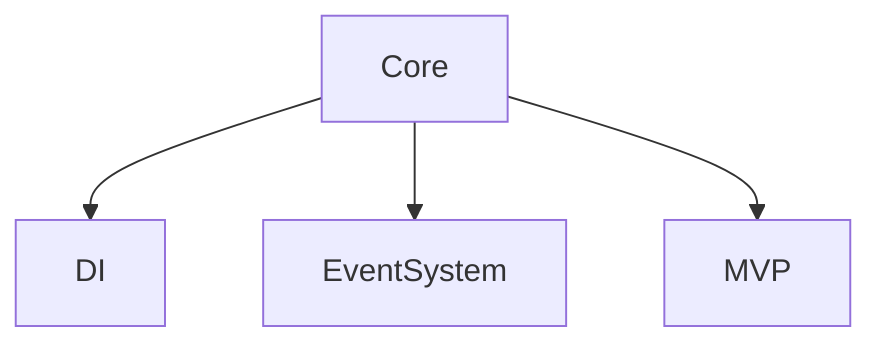

# What

- Game foudation using [Heart](https://github.com/pancake-llc/foundation/tree/main/Assets/Heart) package

<p align="left">
  <a>
    
  </a>
  <a>
    
  </a>
  <a>
    
  </a>
  <a>
    
  </a>
  <a>
    
  </a>
  <a>
    
  </a>
</p>

# Environment

- unity 6 LTS
- scriptingBackend : IL2CPP
- apiCompatibilityLevel : .NET Standard 2.1

# How To Install

You can choose one of the following ways

1, Using button `Use this template` to create new project using this template, and now you can do anything with this

2, for only install heart as package module ----> add directly in `manifest.json` in folder `Packages/manifest.json`

```csharp
"com.pancake.heart": "https://github.com/pancake-llc/foundation.git?path=Assets/Heart#3.1.5",
```


# Folder Structure

```bash
├── _Root
│   ├── Animations
│   ├── Editor
│   ├── Effects
│   ├── Fonts
│   ├── Materials
│   ├── Prefabs
│   ├── Resources
│   ├── Scenes
│   ├── Scripts
│   ├── Sounds
│   ├── Spines
│   ├── Sprites
│   ├── Storages
├── Heart
│   ├── Common
│   ├── Core
│   ├── Editor
│   ├── Modules
└── ...
```

**DO not put anything into folder Heart, any new asset should be place under folder _Root**


# Pillar



# Usages

- [See Wiki](https://github.com/pancake-llc/foundation/wiki)

